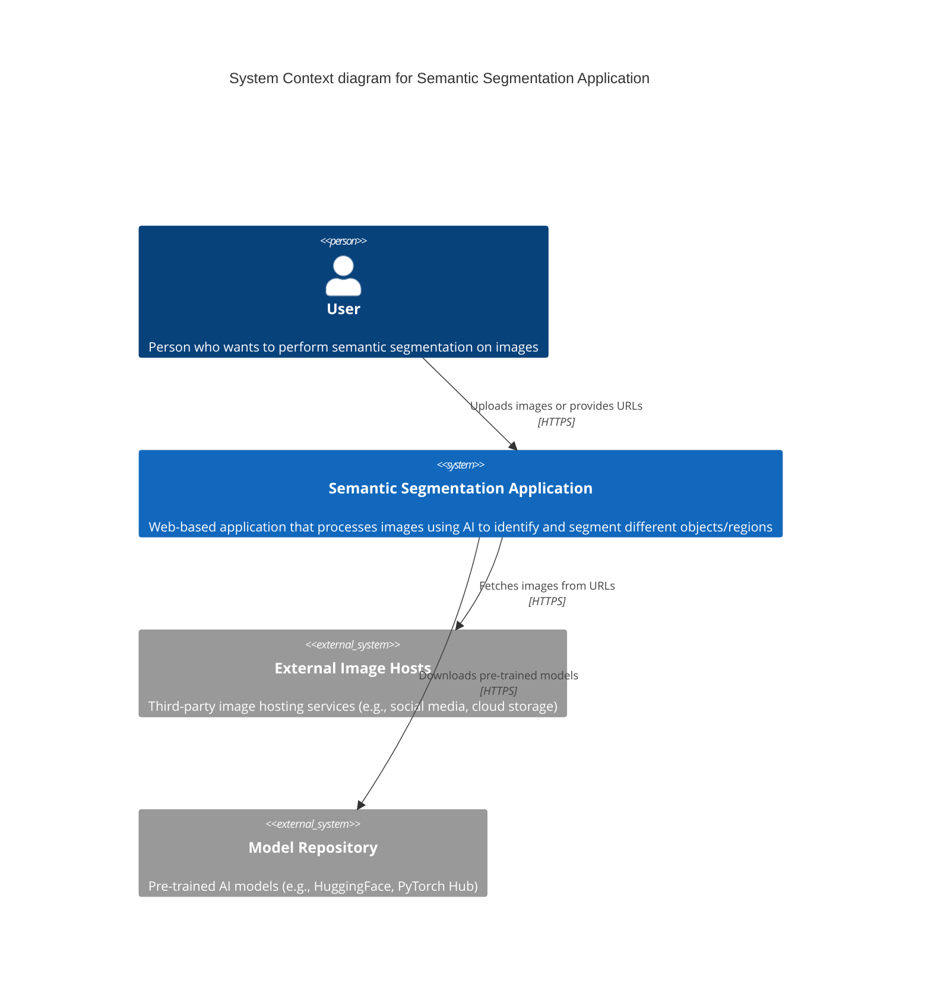
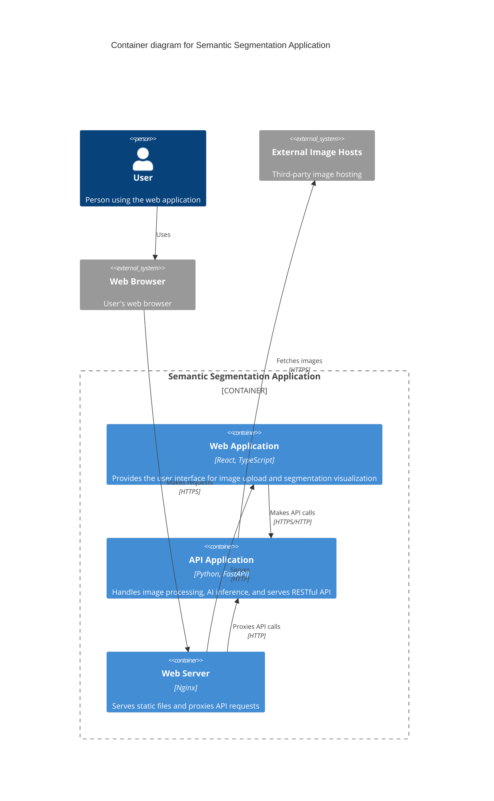
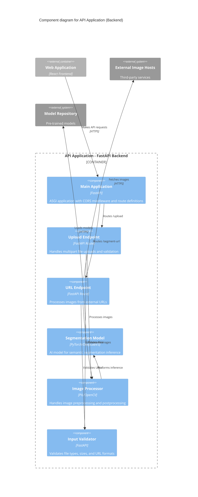
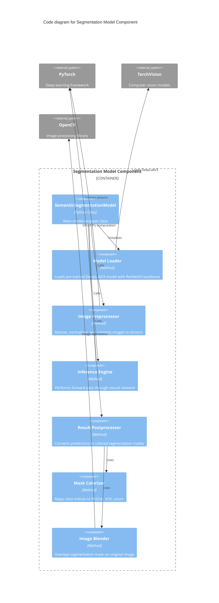
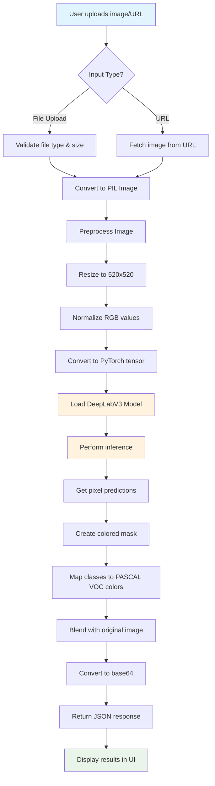
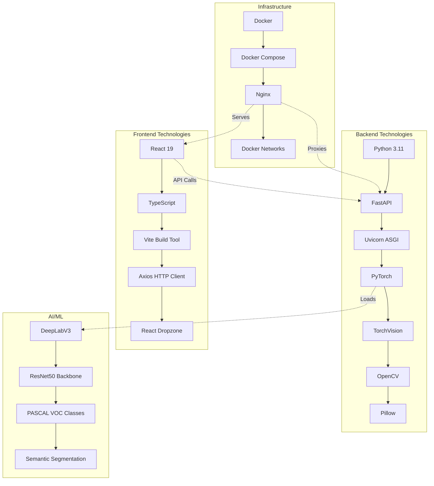

# Semantic Segmentation Application Architecture

This document provides C4 model diagrams for the web-based semantic segmentation application using Mermaid notation.

## C4 Level 1: System Context Diagram



## C4 Level 2: Container Diagram



## C4 Level 3: Component Diagram - Frontend

```mermaid
C4Component
    title Component diagram for Web Application (Frontend)
    
    Container_Boundary(webapp, "Web Application - React Frontend") {
        Component(app, "App Component", "React Component", "Main application component, manages global state")
        Component(uploader, "Image Uploader", "React Component", "Handles file uploads with drag & drop functionality")
        Component(urlInput, "URL Input", "React Component", "Allows users to input external image URLs")
        Component(display, "Image Display", "React Component", "Shows original and segmented images side-by-side")
        Component(apiService, "API Service", "Axios Client", "Handles HTTP communication with backend API")
        Component(types, "Type Definitions", "TypeScript", "Defines interfaces for API responses and data models")
    }
    
    Container_Ext(api, "API Application", "FastAPI Backend")
    Container_Ext(nginx, "Web Server", "Nginx")
    
    Rel(app, uploader, "Renders", "")
    Rel(app, urlInput, "Renders", "")
    Rel(app, display, "Renders", "")
    Rel(uploader, apiService, "Calls upload API", "")
    Rel(urlInput, apiService, "Calls URL processing API", "")
    Rel(apiService, types, "Uses", "")
    Rel(apiService, api, "Makes HTTP requests", "HTTPS")
    Rel(nginx, webapp, "Serves built assets", "HTTP")
    
    UpdateLayoutConfig($c4ShapeInRow="3", $c4BoundaryInRow="1")
```

## C4 Level 3: Component Diagram - Backend



## C4 Level 4: Code Diagram - Segmentation Model



## Deployment Diagram

```mermaid
C4Deployment
    title Deployment diagram for Semantic Segmentation Application
    
    Deployment_Node(docker, "Docker Environment", "Container Runtime") {
        Deployment_Node(frontend_container, "Frontend Container", "nginx:alpine") {
            Container(nginx_prod, "Nginx", "Web Server", "Serves React app and proxies API calls")
            Container(react_build, "React App", "Static Files", "Production build of frontend application")
        }
        
        Deployment_Node(backend_container, "Backend Container", "python:3.11-slim") {
            Container(fastapi_app, "FastAPI", "ASGI Server", "Python backend with uvicorn")
            Container(ml_models, "AI Models", "PyTorch", "DeepLabV3 segmentation model")
        }
        
        Deployment_Node(network, "Docker Network", "Bridge Network") {
            ContainerDb(bridge, "segmentation-network", "Internal communication")
        }
    }
    
    Deployment_Node(host, "Host Machine", "Docker Host") {
        Deployment_Node(ports, "Port Mapping", "Host Ports") {
            Container(port80, "Port 80", "HTTP", "Frontend access")
            Container(port8000, "Port 8000", "HTTP", "Backend API access")
        }
    }
    
    Person(user, "User", "Application user")
    
    Rel(user, port80, "Accesses web app", "HTTP")
    Rel(user, port8000, "Direct API access", "HTTP")
    Rel(port80, nginx_prod, "Routes to", "")
    Rel(port8000, fastapi_app, "Routes to", "")
    Rel(nginx_prod, fastapi_app, "Proxies /api/*", "HTTP")
    Rel(react_build, nginx_prod, "Served by", "")
    Rel(fastapi_app, ml_models, "Uses", "")
    Rel(frontend_container, bridge, "Connected to", "")
    Rel(backend_container, bridge, "Connected to", "")
    
    UpdateLayoutConfig($c4ShapeInRow="2", $c4BoundaryInRow="1")
```

## Data Flow Diagram



## Technology Stack Overview



## Security & Performance Considerations

### Security Features
- CORS middleware for cross-origin requests
- Input validation for file types and URLs
- Nginx security headers (XSS protection, content type sniffing prevention)
- No sensitive data exposure in responses
- Container isolation with Docker networks

### Performance Optimizations
- Multi-stage Docker builds for smaller images
- Asset compression and caching in Nginx
- Model caching to avoid repeated downloads
- Efficient image processing with PIL/OpenCV
- GPU acceleration support for inference (when available)

### Monitoring & Health Checks
- Docker health checks for both containers
- API endpoint health monitoring
- Graceful error handling and fallbacks
- Structured logging for debugging